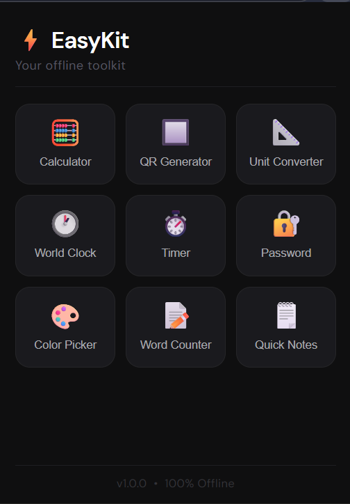

# ⚡ EasyKit — Your All-in-One Offline Browser Toolkit
 
EasyKit is a free, lightweight browser extension that gives you 9 powerful everyday tools in a single click — right from your toolbar. No internet required. No ads. No sign-up.
 
---
 
## 🛠️ Tools Included
 
| Tool | Description |
|---|---|
| 🧮 Calculator | Full-featured calculator with expression display |
| 🔲 QR Generator | Generate QR codes for any URL or text instantly |
| 📐 Unit Converter | Convert length, weight, temperature, speed and area |
| 🕐 World Clock | Live time across 9 major cities worldwide |
| ⏱️ Timer & Stopwatch | Countdown timer with progress bar and lap recording |
| 🔐 Password Generator | Generate strong passwords with strength meter |
| 🎨 Color Picker | Pick colors and copy HEX, RGB, HSL values |
| 📝 Word Counter | Live word, character, sentence and reading time stats |
| 🗒️ Quick Notes | Auto-saved notes that persist across sessions |
 
---
 
## ✨ Features
 
- ⚡ **Instant access** — one click on the toolbar icon
- 📡 **100% offline** — all tools work without internet
- 💾 **Persistent notes** — Quick Notes saved locally via `chrome.storage`
- 🎨 **Clean dark UI** — consistent dark theme across all tools
- 🔒 **Privacy first** — no data collection, no tracking, no analytics
- 🆓 **Completely free** — no premium, no subscription, no ads
---
 
## 📸 Screenshots
 
> Home Screen — All 9 tools in one place

 
---
 
## 🚀 Installation
 
### Microsoft Edge (Recommended)
1. Go to [EasyKit on Edge Add-ons Store](https://microsoftedge.microsoft.com/addons)
2. Click **"Get"**
3. Click **"Add extension"**
4. Click ⚡ icon in toolbar to open EasyKit
### Google Chrome
1. Go to [EasyKit on Edge Add-ons Store](https://microsoftedge.microsoft.com/addons)
2. Click **"Allow extensions from other stores"**
3. Click **"Add to Chrome"**
4. Click ⚡ icon in toolbar to open EasyKit
### Manual Installation (Developer Mode)
1. Download or clone this repository
2. Open Edge → go to `edge://extensions/`
3. Enable **Developer Mode**
4. Click **"Load unpacked"**
5. Select the `EasyKit` folder
---
 
## 📁 Project Structure
 
```
EasyKit/
├── manifest.json
├── popup.html
├── popup.css
├── popup.js
├── icons/
│   ├── icon16.png
│   ├── icon48.png
│   └── icon128.png
└── tools/
    ├── calculator/
    │   ├── index.html
    │   ├── style.css
    │   └── script.js
    ├── qr-generator/
    │   ├── index.html
    │   ├── style.css
    │   ├── script.js
    │   └── qrcode.min.js
    ├── unit-converter/
    │   ├── index.html
    │   ├── style.css
    │   └── script.js
    ├── world-clock/
    │   ├── index.html
    │   ├── style.css
    │   └── script.js
    ├── timer/
    │   ├── index.html
    │   ├── style.css
    │   └── script.js
    ├── password/
    │   ├── index.html
    │   ├── style.css
    │   └── script.js
    ├── color-picker/
    │   ├── index.html
    │   ├── style.css
    │   └── script.js
    ├── word-counter/
    │   ├── index.html
    │   ├── style.css
    │   └── script.js
    └── notes/
        ├── index.html
        ├── style.css
        └── script.js
```
 
---
 
## 🔧 Tech Stack
 
| Technology | Usage |
|---|---|
| HTML5 | Structure for all tools |
| CSS3 | Styling and dark theme |
| JavaScript (ES6+) | Logic for all tools |
| Chrome Extension Manifest V3 | Extension framework |
| chrome.storage.local | Persistent notes storage |
| qrcode.js | Offline QR code generation |
| DM Sans & DM Mono | Typography (Google Fonts) |
 
---
 
## 🔒 Permissions
 
EasyKit requests only **one permission:**
 
| Permission | Reason |
|---|---|
| `storage` | Save Quick Notes locally on your device |
 
No network access, no tab access, no browsing history — nothing else.
 
---
 
## 🌐 Browser Support
 
| Browser | Supported |
|---|---|
| Microsoft Edge | ✅ Yes |
| Google Chrome | ✅ Yes |
| Brave | ✅ Yes |
| Opera | ✅ Yes |
| Firefox | ⏳ Coming soon |
| Safari | ❌ Not supported |
 
---
 
## 📦 Dependencies
 
| Dependency | Version | Usage |
|---|---|---|
| qrcode.js | Latest | Offline QR code generation |
 
No other external dependencies — everything else is pure vanilla HTML, CSS and JavaScript.
 
---
 
## 🗺️ Roadmap
 
- [ ] Firefox support
- [ ] BMI Calculator
- [ ] Age Calculator
- [ ] Pomodoro Timer
- [ ] JSON Formatter
- [ ] Base64 Encoder / Decoder
- [ ] Markdown Previewer
- [ ] Theme customization
---
 
## 🤝 Contributing
 
Contributions are welcome! Here's how:
 
1. Fork the repository
2. Create a new branch
```
git checkout -b feature/new-tool
```
3. Make your changes
4. Commit your changes
```
git commit -m "Add new tool"
```
5. Push to the branch
```
git push origin feature/new-tool
```
6. Open a Pull Request
---
 
## 🐛 Bug Reports
 
Found a bug? Please open an issue with:
- Browser name and version
- Steps to reproduce
- Expected vs actual behavior
- Screenshots if possible
---
 
## 📄 Privacy Policy
 
EasyKit does **not** collect, store, or transmit any personal data.
 
- **Quick Notes** data is stored **locally** on your device only using `chrome.storage.local`
- This data **never leaves your device**
- No third party services or APIs are used
- No analytics or tracking of any kind
- No user accounts or sign-up required
---
 
## 📜 License
 
This project is licensed under the **MIT License** — free to use, modify and distribute.
 
```
MIT License
 
Copyright (c) 2026 EasyKit
 
Permission is hereby granted, free of charge, to any person obtaining a copy
of this software and associated documentation files (the "Software"), to deal
in the Software without restriction, including without limitation the rights
to use, copy, modify, merge, publish, distribute, sublicense, and/or sell
copies of the Software, and to permit persons to whom the Software is
furnished to do so, subject to the following conditions:
 
The above copyright notice and this permission notice shall be included in all
copies or substantial portions of the Software.
 
THE SOFTWARE IS PROVIDED "AS IS", WITHOUT WARRANTY OF ANY KIND, EXPRESS OR
IMPLIED, INCLUDING BUT NOT LIMITED TO THE WARRANTIES OF MERCHANTABILITY,
FITNESS FOR A PARTICULAR PURPOSE AND NONINFRINGEMENT.
```
 
---
 
## 👨‍💻 Author
 
Built using pure HTML, CSS and JavaScript.
 
---
 
## ⭐ Support
 
If you find EasyKit useful, please:
- ⭐ Star this repository
- 📝 Leave a review on the Edge Add-ons store
- 📢 Share with your friends and colleagues
---
 
*EasyKit — Because your daily tools should be one click away.*